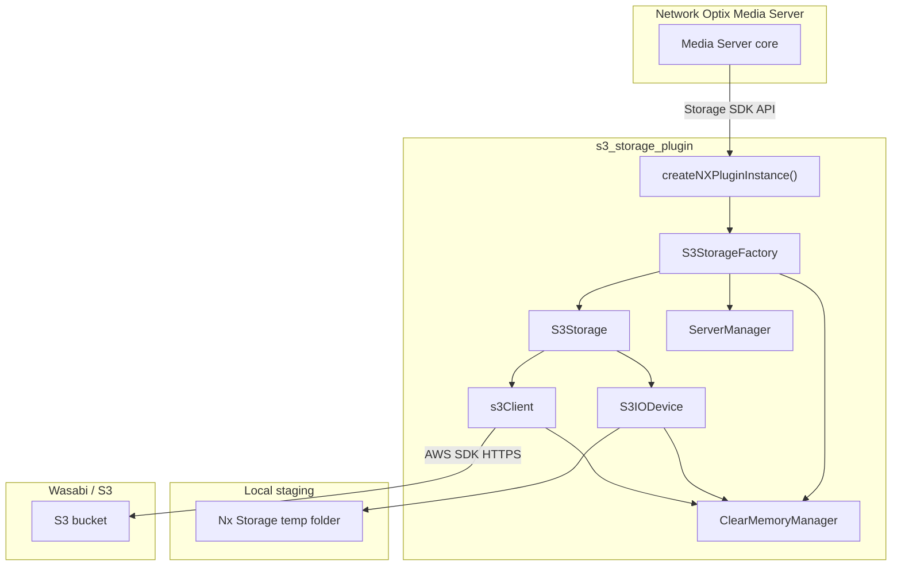

# Wasabi S3 Storage Plugin for Network Optix VMS

This repository contains a **dynamic storage plugin** for the Network Optix (NX) VMS Media Server. The plugin implements the NX **Storage SDK** API and uses **Wasabi** (or any S3-compatible endpoint) as the remote backend for recorded video, metadata, and database files.

**Plugin version:** `beta-global-2.1` (see `samples/s3_storage_plugin/src/common.hpp`).

---

## What it does

The Media Server normally writes recordings to local or network disk. With this plugin installed, the server treats an S3 bucket as a storage location:

1. **Writes** go to a local staging folder first (`%TEMP%/Nx Storage` on Windows, or `$TMP/Nx Storage` on Linux).
2. Files are **uploaded to S3 in the background** via the AWS SDK for C++.
3. **Reads** download objects into the staging folder (when needed) and serve them through standard file I/O.
4. **Free space** is computed as configured bucket capacity minus remote usage minus local staging usage.

The plugin is loaded by the Media Server as `s3_storage_plugin.dll` (Windows) or `libs3_storage_plugin.so` (Linux) from the server’s `plugins/` directory.

---

## High-level architecture



### Core classes

| Component | File(s) | Role |
|-----------|---------|------|
| **Plugin entry** | `S3_library.cpp` | Exports `createNXPluginInstance()`; initializes logging, `ServerManager`, and returns `S3StorageFactory`. |
| **S3StorageFactory** | `S3_library.h`, `S3_library.cpp` | Implements `StorageFactory`: creates `S3Storage` instances, reports storage type `"s3"`, initializes/shuts down AWS SDK. |
| **S3Storage** | `S3_library.h`, `S3_library.cpp` | Implements `Storage`: open files, list/delete/rename, space queries, license checks. |
| **S3IODevice** | `S3_library.h`, `S3_library.cpp` | Implements `IODevice`: buffered read/write on local copies; `flush()` queues S3 upload. |
| **s3Client** | `s3Client.h`, `s3Client.cpp` | AWS S3 client wrapper: connection, upload queue, background upload thread, bucket size updates. |
| **ServerManager** | `ServerManager.h`, `ServerManager.cpp` | Singleton: reads `env.config`, license gating, local buffer size, upload thread limits, optional NX DB sync flag. |
| **ClearMemoryManager** | `ClearMemoryManager.*` | Periodic cleanup of stale local temp files; tracks files being written or pending delete. |
| **ThreadPool** | `ThreadPool.*` | Parallel upload workers (size from `env.config`). |
| **DailyLogger** | `daily_loger.*` | Rotating daily log files for plugin diagnostics. |

SDK interfaces are defined in:

- `src/plugins/plugin_api.h` — plugin loading and reference counting
- `src/storage/third_party_storage.h` — `Storage`, `IODevice`, `StorageFactory`, error codes, capabilities

---

## Request flow

### Opening and writing a file

1. Media Server calls `S3Storage::open(uri, flags)`.
2. A unique local path is built under `Nx Storage` (slashes in the URI become underscores in the filename).
3. For **read**, if the local copy does not exist, `s3Client::downloadFile()` fetches the object from S3.
4. For **write**, a local file is created; `ClearMemoryManager` tracks it as active.
5. `S3IODevice::write()` appends to the local file. On close or flush (e.g. `.nxdb` with sync enabled), `uploadFile()` enqueues the object for background upload.
6. `s3Client`’s upload thread and thread pool push objects to Wasabi.

### Reading a file

1. Local file is opened (downloaded first if missing).
2. `read()` / `seek()` operate on the local `FILE*`.
3. On destructor, read-only temps (except `.nxdb`) may be scheduled for deletion via `ClearMemoryManager`.

### Space reporting

- **Total space:** From `s3.config` when host/bucket match the storage URL; otherwise default **10 TB** (`S3_DEFAULT_TOTAL_SPACE`, 10240 GiB).
- **Free space:** `totalSpace - remoteFolderSize() - localStagingFolderSize`.
- If local staging exceeds `local_buffer` from `env.config`, free space returns **0** and write capability may be disabled until space is reclaimed.

---

## Storage URL format

When adding storage in the VMS UI, the URL must follow this pattern (parsed by `aux::Url::fromString` in `common.hpp`):

```text
s3://<access_key>:<secret_key>@<endpoint>/<bucket_name>
```

Optional port (uncommon for Wasabi):

```text
s3://<access_key>:<secret_key>@<host>:<port>/<bucket_name>
```

**Examples:**

```text
s3://AKIAEXAMPLE:secretkey@https://s3.us-east-1.wasabisys.com/my-recordings-bucket
```

The factory may also receive URLs with an `@https//` prefix stripped before parsing (`S3Storage` constructor).

**Wasabi endpoint:** Use your region endpoint (e.g. `s3.us-east-1.wasabisys.com`) without a path; the bucket name is the path segment after `/`.

On connect, the plugin:

- Lists buckets and creates the bucket if missing
- Writes a small `Test.txt` object to verify write access
- Sets the S3 client `endpointOverride` to the host from the URL

---

## Configuration files

Both files must live next to the Media Server binary (install scripts copy them into the server folder).

### `env.config` (runtime / license / tuning)

Generated by **`Storage_SDK_License_Config`** during install. JSON fields:

| Field | Default | Description |
|-------|---------|-------------|
| `sync_nxdb` | `true` | If true, `.nxdb` files are flushed/uploaded when the calendar date changes (overnight-style DB backup to S3). |
| `local_buffer` | `1` | Local staging limit in **GB**. When exceeded, the plugin reports no free space and may stop accepting writes. |
| `log_level` | `1` | `0` DEBUG, `1` INFO, `2` ERROR (DailyLogger verbosity). |
| `log_max` | `3` | Maximum number of rotated log files to keep. |
| `max_parallel_upload` | `10` | Thread pool size for parallel uploads. |

**License behavior:** `ServerManager::updateLicenseDetail()` runs on a timer. Currently, a valid `env.config` on disk sets `isLicenseAvailable()` to true (NX REST license verification exists in code but is commented out). If `env.config` is missing or invalid, storage type may report as `"unknown"` and operations return `StorageUnavailable`.

### `s3.config` (per-bucket capacity)

Defines logical storage size per Wasabi endpoint/bucket (used for free-space calculation, not a hard S3 quota):

```json
{
  "s3storage": [
    {
      "url": "s3.us-east-1.wasabisys.com",
      "bucket": "my-recordings-bucket",
      "size": 500
    }
  ]
}
```

- `url` — Must match the host part of the storage URL (after stripping `https://`).
- `bucket` — Bucket name from the storage URL path.
- `size` — Capacity in **gigabytes**.

---

## Repository layout

```text
NX_s3_integration/
├── src/
│   ├── plugins/plugin_api.h          # NX plugin COM-style API
│   └── storage/third_party_storage.h # Storage SDK interfaces
├── samples/
│   ├── s3_storage_plugin/            # Main plugin source
│   ├── Storage_SDK_License_Config/   # Interactive env.config generator
│   └── Hex_Key_Generator/            # Utility sample
├── install-storage-sdk/              # Linux install bundle
├── install-storage-sdk-window/       # Windows install bundle
├── lib/                              # jsoncpp (via setup.sh)
├── licenses/                         # Third-party license texts
├── setup.sh                          # Build AWS SDK + jsoncpp (Linux)
├── build_samples.sh / .bat           # CMake build all samples
└── package.sh                        # Tar install bundle (Linux)
```

Built artifacts (after compile) typically appear under `NX_s3_integration-build/` adjacent to the repo.

---

## Building from source

### Prerequisites

- **CMake** 3.13+
- **C++17** compiler
- **AWS SDK for C++** (S3 component), **libcurl**, **OpenSSL**, **zlib** (Linux)
- **jsoncpp** (static library under `lib/jsoncpp/`)
- On Windows: vcpkg paths in `samples/s3_storage_plugin/src/CMakeLists.txt` may need updating for AWS SDK, curl, and jsoncpp locations

### Linux dependency setup

```bash
./setup.sh
```

This installs system packages, builds AWS SDK for C++ (S3 only, static), and builds jsoncpp.

### Build samples

```bash
./build_samples.sh          # Release
./build_samples.sh --debug  # Debug
```

Windows:

```bat
build_samples.bat
```

Outputs include:

- `libs3_storage_plugin.so` / `s3_storage_plugin.dll`
- `Storage_SDK_License_Config` executable

See `src/nx/sdk/dynamic_libraries.md` for NX guidance on linking shared vs static dependencies when deploying plugins.

---

## Installation

**Stop the Media Server before installing or replacing the plugin.**

### Windows

1. Run `install-storage-sdk-window/install.bat` **as Administrator**.
2. Complete prompts from `Storage_SDK_License_Config.exe` (buffer size, logging, NX DB sync, upload threads).
3. Select the Media Server installation folder when prompted.
4. The script copies:
   - `s3_storage_plugin.dll` → `<MediaServer>/plugins/`
   - `env.config`, `s3.config` → `<MediaServer>/` (or `bin/` per bundle layout)
   - Supporting DLLs from `lib/` if present
5. Start the Media Server.
6. In the VMS client, add a storage location using the `s3://...` URL format above.

### Linux

1. Run `install-storage-sdk/install.sh` as root (installs zenity and dependencies).
2. Run the license config tool and select the Media Server folder.
3. Files are copied to `<MediaServer>/bin/` and `bin/plugins/`.
4. Start the Media Server and configure storage in the client.

Edit `s3.config` before or after install to match your Wasabi bucket and desired reported capacity.

---

## Background services

| Mechanism | Interval / trigger | Purpose |
|-----------|-------------------|---------|
| `ServerManager` timer | 1 min → 10 min after config load | Reload `env.config`, license state |
| `ClearMemoryManager` timer | 1 minute | Delete orphaned local temp files |
| `s3Client` upload thread | Continuous | Drain upload queue |
| `s3Client` space thread | Periodic | Refresh `remoteFolderSize()` for free-space math |
| `UploadList.json` | Persistent queue | Resume uploads across restarts |

**User-Agent** sent to S3 (set in `s3Client::initializeConnection`):

```text
Wasabi/<VERSION> <VMS> <OS>/<version>
```

Example: `Wasabi/beta-global-2.1  Windows/10.0.26200`

---

## Capabilities and special cases

The plugin advertises (via `getCapabilities()`):

- List, read, remove files
- Write (only while local buffer is under limit)
- `DBReady` — suitable for database-style files (`.nxdb`)

**Video (`.mkv`):** Filename normalization on delete; listing/download behavior aligned with NX chunk naming.

**`info.txt`:** Flushed and removed locally on close.

**Read vs write temp names:** Historical fix prefixes `read` / `write` in temp names to avoid collisions when both modes open at once.

---

## Samples and utilities

| Sample | Purpose |
|--------|---------|
| `s3_storage_plugin` | Production storage plugin |
| `Storage_SDK_License_Config` | CLI wizard that writes `env.config` |
| `Hex_Key_Generator` | Auxiliary key utility (build with samples) |

---

## Troubleshooting

| Symptom | Things to check |
|---------|-----------------|
| Storage type `unknown` / unavailable | `env.config` present and valid next to mediaserver binary; restart server after install |
| Cannot connect to Wasabi | Access key, secret, endpoint region, bucket name in URL; firewall HTTPS outbound |
| “No free space” while bucket has room | Local `Nx Storage` over `local_buffer` GB; wait for uploads or clear temp folder |
| Slow playback / recording | Increase `max_parallel_upload`; ensure staging disk is fast SSD; see changelog in `samples/s3_storage_plugin/readme.md` |
| Logs | Daily log files from `DailyLogger` (verbosity via `log_level`) |

---

## Version history

Detailed release notes and fixes (1.0.3–1.0.5, performance, licensing) are in:

[`samples/s3_storage_plugin/readme.md`](samples/s3_storage_plugin/readme.md)

---

## Licenses

- NX Storage SDK headers: **MPL 2.0** (Network Optix)
- Third-party texts: [`licenses/`](licenses/)
- Plugin integrates **AWS SDK for C++**, **libcurl**, **jsoncpp**, and other dependencies per your build setup

---

## Related documentation

- NX plugin dynamic linking: [`src/nx/sdk/dynamic_libraries.md`](src/nx/sdk/dynamic_libraries.md)
- Storage API reference: [`src/storage/third_party_storage.h`](src/storage/third_party_storage.h)
- Plugin API: [`src/plugins/plugin_api.h`](src/plugins/plugin_api.h)
